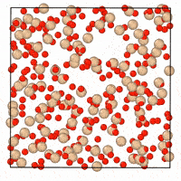
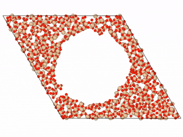

##  DM2: diffusion models for disordered materials

This repo is mainly adapted from [LLNL/graphite](https://github.com/LLNL/graphite/) (version Dec 12, 2023).
Modifications to the original code from [Tim Hsu](https://github.com/tim-hsu) were made to include an embedding for the processing conditions of the glassy materials, and integrate the generation with the simulation of amorphous structures.
This code is provided as a separate snapshot to ensure reproducibility of [our manuscript](https://arxiv.org/abs/2507.05024), but considering that the credits for the original `graphite` code belong to Hsu.

# 📂 Gallery

### Generation of cubic a-SiO₂ 
<p align="center">
  
</p>

### Generation of cubic a-SiO₂ (slice view)
<p align="center">
  
</p>

### Generation of amorphous mesoporous SiO₂ (slice view)
<p align="center">
  
</p>

### Generation of cubic Cu<sub>2</sub>Zr<sub>2</sub> (slice view)
<p align="center">
  
</p>


# 📂 Directory Overview
- **demo/** — Example scripts for generation and training
  - `gen_data/` — Input data generation utilities
  - `inital_data/` — Initial random structures (e.g., SiO₂)
    - `random_sio2_size_300_data/`
    - `random_sio2_size_3000_data/`
  - `denoise_generate_demo.py` — Unconditional generation example
  - `denoise_train_conditional.py` — Conditional training example
  - `denoiser_train.py` — Unconditional training example

- **model/** — Pretrained diffusion models
  - `gen-a-sio2-cond-v1.pt` — Conditional SiO₂ generator
  - `gen-a-sio2-v1` — Unconditional SiO₂ generator
  - `gen-cu50zr50-v1.pt` — Cu–Zr metallic glass generator

- **src/** — Core source code and utilities


# 🧪 Demo: Generating Amorphous SiO₂

A demo script is provided at
```~/demo/denoise_generate_demo.py```
for generating amorphous SiO₂ structures using the trained  model.

Before running the demo, you may need to make minor adjustments (changing GPU ID or updating relevant file paths). Once configured, simply execute the script to reproduce the sample generation results.

The demo generating 300-atom a-SiO₂ took about 1.5 mins on NVIDIA RTX A6000.

# ⚙️ Installation

Common packages:
- `numpy`
- `scikit-learn`
- `pandas`
- `ase`

```bash
pip install numpy scikit-learn pandas ase
```
Install pytorch and other packages for graph data.
```bash
pip install torch==2.5.1 torchvision torchaudio --index-url https://download.pytorch.org/whl/cu124

pip install torch_geometric

pip install torch_scatter torch_cluster -f https://data.pyg.org/whl/torch-2.3.0+cu121.html
```

Install e3nn with specific version.
The latest version of e3nn may cause some error.
```bash
pip install "e3nn==0.4.4"
```

Then, clone the repo and install ```dm2```
```bash
pip install -e /path/to/the/repo
```

To uninstall:
```bash
pip uninstall graphite
```

# Citing

If using this code, please cite the following papers:

```
@article{yang2025generative,
  title={A generative diffusion model for amorphous materials},
  author={Yang, Kai and Schwalbe-Koda, Daniel},
  journal={arXiv:2507.05024},
  year={2025}
}

@article{hsu2024score,
  title={Score-based denoising for atomic structure identification},
  author={Hsu, Tim and Sadigh, Babak and Bertin, Nicolas and Park, Cheol Woo and Chapman, James and Bulatov, Vasily and Zhou, Fei},
  journal={npj Computational Materials},
  volume={10},
  number={1},
  pages={155},
  year={2024},
}
```
We thank the support from TRI for this project.

<p align="center">
  
</p>